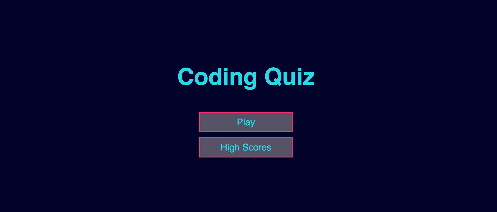
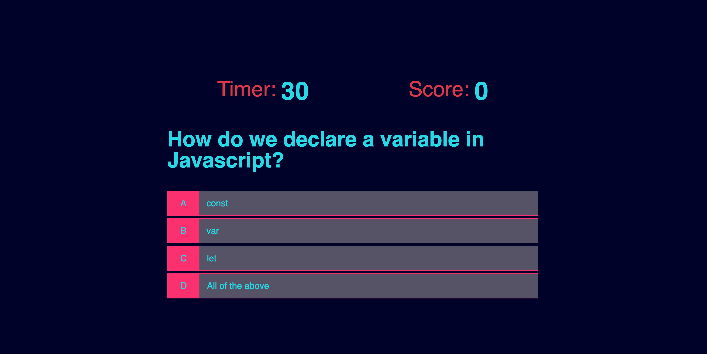
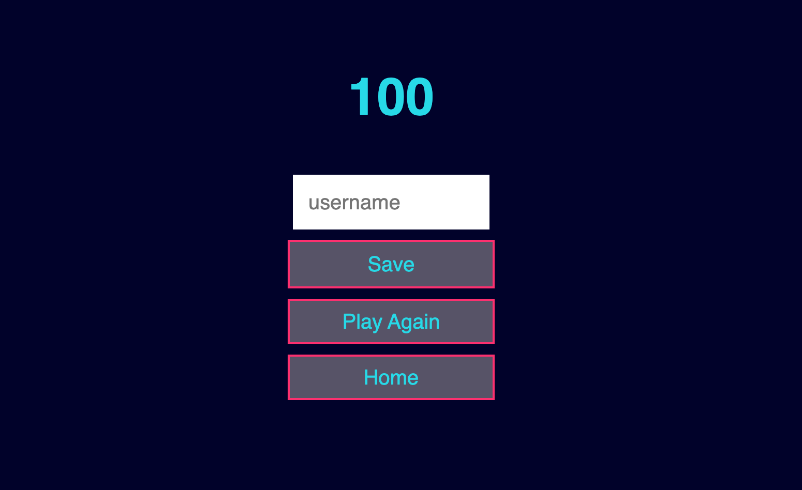
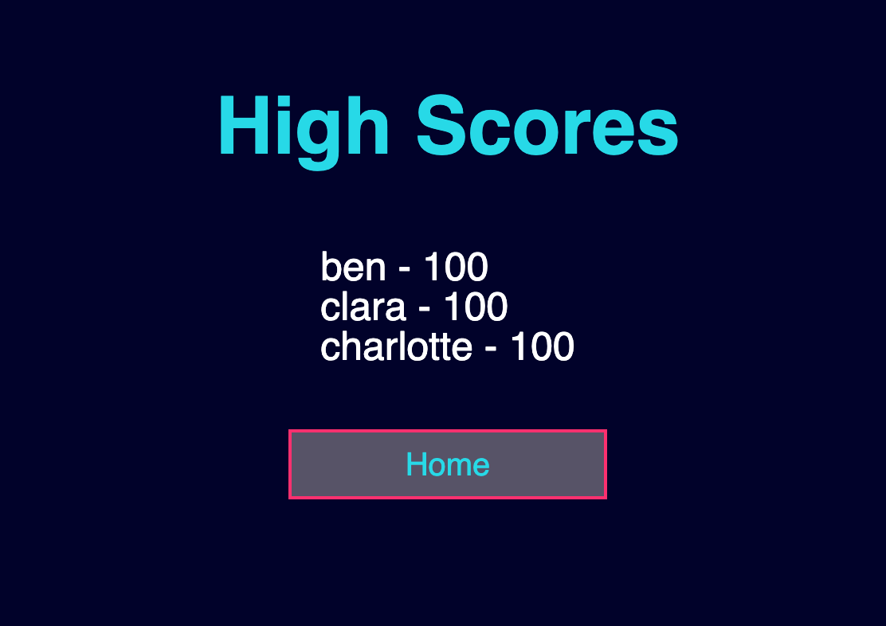

# js-quiz

## Description

This challenge really pushed me to my limit. I spent hours on the javascript catching bugs and making sure everything worked the way I had envisioned it to. At first it seemed like an impossible task and now Im able to look at it and confidently say that Im proud of what I've learned in just a few weeks of this bootcamp. I had fun messing around with the CSS to give it a look that I wasnt bored with after going through the quiz as many times as I did, and Im happy with the result. I learned some new ways to style a page, I learned how to link multiple pages together. and most importantly I feel a little more comfortable using Javascript. 

## Usage

To start the quiz press the "Play" button. this will take you to a new screen where you will be prompted with a few multiple choice questions. once youre done answering the questions you will be taken to your score page where you will be able to save you score. Once you save your score you will be taken back to the home page and given to option to look at the "High Scores" page to see if youve made the top three high scores.

    

## Credits

List your collaborators, if any, with links to their GitHub profiles.

If you used any third-party assets that require attribution, list the creators with links to their primary web presence in this section.

If you followed tutorials, include links to those here as well.

## License

The last section of a high-quality README file is the license. This lets other developers know what they can and cannot do with your project. If you need help choosing a license, refer to [https://choosealicense.com/](https://choosealicense.com/).

---

🏆 The previous sections are the bare minimum, and your project will ultimately determine the content of this document. You might also want to consider adding the following sections.

## Badges

Badges aren't necessary, per se, but they demonstrate street cred. Badges let other developers know that you know what you're doing. Check out the badges hosted by [shields.io](https://shields.io/). You may not understand what they all represent now, but you will in time.

## Features

If your project has a lot of features, list them here.

## How to Contribute

If you created an application or package and would like other developers to contribute it, you can include guidelines for how to do so. The [Contributor Covenant](https://www.contributor-covenant.org/) is an industry standard, but you can always write your own if you'd prefer.

## Tests

Go the extra mile and write tests for your application. Then provide examples on how to run them here.

